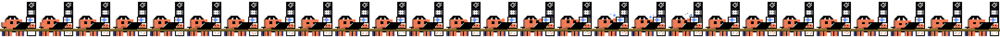

# Clawd 🐾

A pixel-art desktop pet that reacts to your [Claude Code](https://docs.anthropic.com/en/docs/claude-code) session in real time.

Clawd sits on your screen, types when you're working, claps when a task finishes, and idles with headphones when you step away — all driven by Claude Code's [hooks API](https://docs.anthropic.com/en/docs/claude-code/hooks).



## How it works

```
Claude Code hooks ──▶ state.json ──▶ Clawd (Electron)
                                        ├── typing animation
                                        ├── clapping on task complete
                                        ├── idle headphones after 60s
                                        └── speech bubbles
```

Clawd reads a tiny JSON file (`state.json`) once per second. Claude Code's PostToolUse and Stop hooks write events to that file. No conversation content is ever transmitted — only event type and timestamp.

## Requirements

- **Windows 10/11** (macOS/Linux support planned)
- **Node.js** 18+
- **Claude Code** CLI

## Quick start

```bash
# 1. Clone and install
git clone https://github.com/user/clawd.git
cd clawd
npm install

# 2. Configure Claude Code hooks (see below)

# 3. Launch
npm start
```

## Hook setup

Add the following to your Claude Code settings file at `~/.claude/settings.json`.

### PostToolUse hook (tells Clawd when Claude is working)

```jsonc
{
  "hooks": {
    "PostToolUse": [
      {
        "hooks": [
          {
            "type": "command",
            "command": "mkdir -p \"$LOCALAPPDATA/clawd\" && printf '{\"event\":\"tool_call\",\"timestamp\":%s000}' \"$(date +%s)\" > \"$LOCALAPPDATA/clawd/state.json\"",
            "timeout": 3
          }
        ]
      }
    ],
    "Stop": [
      {
        "hooks": [
          {
            "type": "command",
            "command": "mkdir -p \"$LOCALAPPDATA/clawd\" && printf '{\"event\":\"stop\",\"timestamp\":%s000}' \"$(date +%s)\" > \"$LOCALAPPDATA/clawd/state.json\"",
            "timeout": 3
          }
        ]
      }
    ]
  }
}
```

### Status line (optional — shows usage percentage under Clawd)

```jsonc
{
  "statusLine": {
    "type": "command",
    "command": "node \"PATH_TO_CLAWD/statusline-clawd.js\""
  }
}
```

Replace `PATH_TO_CLAWD` with the actual path to where you cloned this repo.

## Animations

| Event | Animation | Trigger |
|-------|-----------|---------|
| Typing | Working at desk | Any tool call |
| Clapping | Applause | Session stop / task complete |
| Sunglasses | Cool pose | Tray menu |
| Headphones | Listening to music | 60s idle / tray menu |
| Latte | Drinking coffee | Tray menu |

## Tray menu

Click the system tray icon to trigger animations manually:

- ☕ Give Clawd coffee
- 👏 Clap
- 😎 Sunglasses
- 🎧 Listen to music
- ⌨ Typing
- ❌ Quit

## Click interaction

Click on Clawd to poke — shakes and says a random line.  
Drag to reposition.

## Speech system

Clawd speaks automatically during animations. You can also send custom speech from Claude Code:

```bash
printf '{"text":"reading docs","timestamp":%s000}' "$(date +%s)" > "$LOCALAPPDATA/clawd/speech.json"
```

## Privacy

Clawd reads **only** event types (`tool_call`, `stop`) and timestamps from `state.json`. No conversation content, file paths, or code is ever accessed. The hooks write nothing but the event name.

## State file location

| OS | Path |
|----|------|
| Windows | `%LOCALAPPDATA%\clawd\state.json` |

## Credits

Pixel art and concept by [@feefee](https://github.com/feefee).  
Built with Claude Code.

## License

MIT
